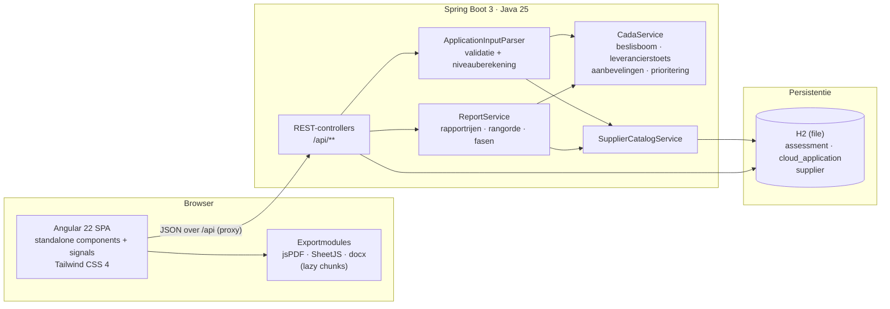
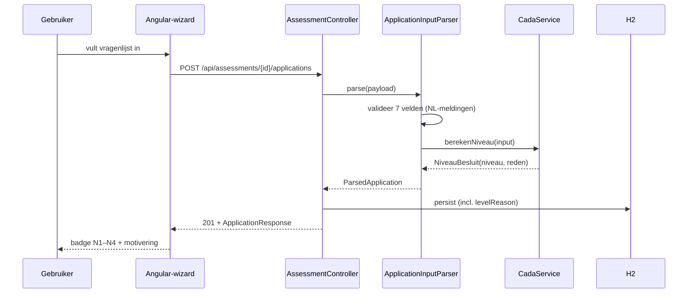
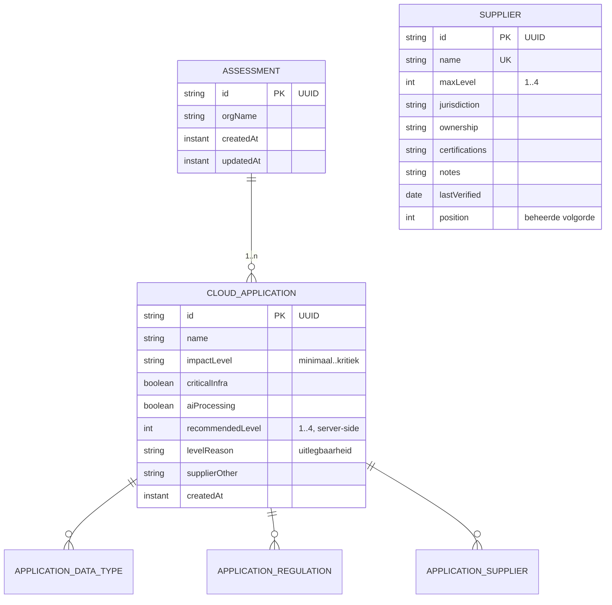
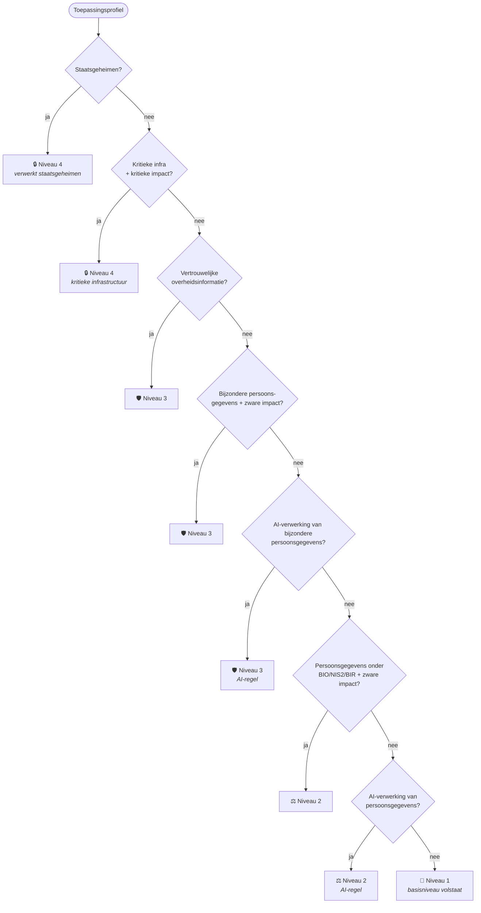
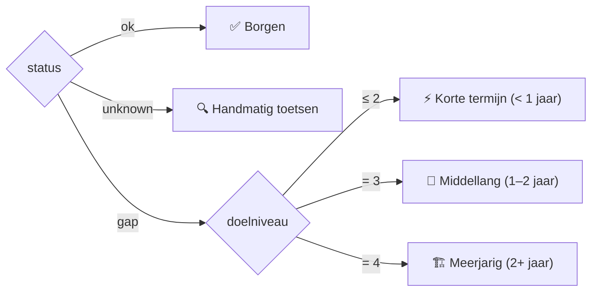

<div align="center">

# 🏛️ CADA Sovereignty Navigator

**Bepaal per cloudtoepassing het vereiste EU-soevereiniteitsniveau onder de
Cloud and AI Development Act — van vragenlijst tot auditeerbare roadmap.**


*Dossier openen → toepassingen profileren → leveranciers toetsen → gap-rapport
met roadmap → exporteren naar PDF, Excel of Word.*

</div>

---

## 📑 Inhoudsopgave

1. [Waarom dit instrument](#-waarom-dit-instrument)
2. [De vier soevereiniteitsniveaus](#-de-vier-soevereiniteitsniveaus)
3. [Functionaliteit](#-functionaliteit)
4. [Architectuur](#-architectuur)
   - [Systeemoverzicht](#systeemoverzicht)
   - [Request-flow](#request-flow)
   - [Domeinmodel](#domeinmodel)
   - [De beslisboom](#de-beslisboom)
   - [Roadmapfasering](#roadmapfasering)
5. [REST API-referentie](#-rest-api-referentie)
6. [Snel starten](#-snel-starten)
7. [Teststrategie](#-teststrategie)
8. [Ontwerpsysteem](#-ontwerpsysteem)
9. [Architectuurbeslissingen (ADR's)](#-architectuurbeslissingen-adrs)
10. [Roadmap](#-roadmap)
11. [Probleemoplossing](#-probleemoplossing)
12. [Begrippenlijst](#-begrippenlijst)
13. [Disclaimer](#-disclaimer)

---

## 🎯 Waarom dit instrument

De **Cloud and AI Development Act (CADA)** is per **augustus 2026** van kracht
en verplicht overheidsinstanties om per cloudtoepassing te bepalen welk
EU-soevereiniteitsniveau van toepassing is. Dat vraagt om drie dingen die in
de praktijk zelden samen op tafel liggen:

1. een **reproduceerbare niveaubepaling** per toepassing (geen onderbuik, maar
   een beslisboom die uitlegt *waarom* een niveau geldt);
2. een **actuele leveranciersreferentie** (welke aanbieder kan welk niveau
   waarmaken, en op grond waarvan);
3. een **bestuurbare roadmap** (welke migratie eerst, en op welke termijn).

De Navigator automatiseert alle drie, houdt de volledige berekening
server-side (en dus niet te omzeilen), en levert het resultaat als
professioneel rapport op.

---

## 🪜 De vier soevereiniteitsniveaus

Elk niveau omvat cumulatief de eisen van de onderliggende niveaus — vandaar
het signatuurelement van de interface: de **soevereiniteitsladder**, vier
oplopende balken waarvan er goud gevuld zijn tot en met het geldende niveau.

| Niveau | Naam | Kern | Typische trigger |
| :---: | --- | --- | --- |
| **1** | Locatie | Data staat fysiek op Europees grondgebied | Basisniveau voor al het cloudgebruik |
| **2** | Onafhankelijkheid | Juridisch onafhankelijk van niet-EU-landen + transparante softwarestack | Persoonsgegevens onder BIO/NIS2/BIR met zware impact; AI-verwerking van persoonsgegevens |
| **3** | EU-controle | Europees eigendom en bestuur | Vertrouwelijke overheidsinformatie; bijzondere persoonsgegevens; AI op bijzondere persoonsgegevens |
| **4** | Soevereiniteit | EU Sovereign-certificering via ENISA, jaarlijkse audit | Staatsgeheimen; kritieke infrastructuur met kritieke impact |

---

## ✨ Functionaliteit

### De vierstaps-wizard

| Stap | Module | Wat gebeurt er |
| :---: | --- | --- |
| 1 | **Toepassingsprofiler** | Zeven vragen per toepassing (naam, datatype, regelgeving, impact, kritieke infrastructuur, AI-verwerking, leveranciers). Live niveau-indicatie mét motivering tijdens het invullen; de definitieve berekening gebeurt bij opslaan — server-side. |
| 2 | **Leverancierstoets** | Elke gekozen leverancier wordt getoetst tegen de referentiedataset: maximaal haalbaar niveau, jurisdictie, eigendom en certificeringen. De zwakste leverancier bepaalt het haalbare niveau. |
| 3 | **Gap-rapport & roadmap** | Samenvattingstabel, prioriteitenmatrix (hoogste impact + grootste gap bovenaan), roadmap per fase en concrete aanbevelingen per toepassing, inclusief migratiekandidaten. |
| 4 | **Export** | PDF (voorpagina, inhoudsopgave, niveau-uitleg, matrix, aanbevelingen), Excel (één rij per toepassing) en Word (bewerkbaar, voor eigen sjablonen). Alle drie client-side gegenereerd en lazy geladen. |

### Daarbuiten

- 📊 **Dossieroverzicht** (`/dossiers`) — portfolio-dashboard met alle
  analyses, toepassings- en gap-tellingen.
- 🗂️ **Leveranciersbeheer** (`/beheer/leveranciers`) — de referentiedataset
  (18 aanbieders) staat in de database en is te beheren zonder redeploy;
  wijzigingen werken direct door in alle dossiers.
- 🔍 **Uitlegbaarheid** — elke niveaubepaling draagt de regel die hem
  bepaalde, zichtbaar in formulier, rapport en alle exports.
- 💾 **Sessieherstel** — het dossier-ID staat in `localStorage`; een analyse
  is later hervatbaar.

---

## 🏗 Architectuur

### Systeemoverzicht

Twee lagen, één bron van waarheid: **alle domeinlogica leeft in de backend**.
De frontend rendert, de backend beslist.



### Request-flow

Het opslaan van een toepassing, van klik tot motivering:



> Tijdens het invullen doet de wizard hetzelfde alvast via
> `POST /api/level-preview` (250 ms-debounce, last-wins) — de gebruiker ziet
> de indicatie live veranderen, maar de opgeslagen waarde komt altijd van de
> server.

### Domeinmodel



`SUPPLIER` is bewust **niet** gerelateerd aan `CLOUD_APPLICATION`: een
toepassing verwijst naar leveranciers op naam. Zo blijft een historisch
dossier leesbaar, ook als een leverancier later uit de referentie verdwijnt —
de leverancierstoets meldt hem dan als "handmatig toetsen".

### De beslisboom

Acht deterministische regels, geëvalueerd van zwaar naar licht. De eerste
regel die vuurt bepaalt niveau **én motivering** (`NiveauBesluit`):



*Zware impact* = `ernstig` of `kritiek`. De AI-regels bestaan omdat de act
niet voor niets *Cloud **and AI** Development Act* heet.

### Roadmapfasering

Elke rapportrij krijgt server-side een uitvoeringsfase, afgeleid van
compliance-status en doelniveau:



De **prioriteitsscore** binnen een fase is `impactgewicht × 10 + gap`
(hoogste eerst), met de Nederlandse collator als tiebreaker op naam.

---

## 🔌 REST API-referentie

Alle endpoints spreken JSON; foutmeldingen zijn gebruikersgericht Nederlands:
`{ "error": "Geef de toepassing een naam." }` (HTTP 400) of
`{ "error": "Sessie niet gevonden." }` (HTTP 404).

### Dossiers

| Methode | Pad | Doel |
| --- | --- | --- |
| `POST` | `/api/assessments` | Dossier openen — `{ "orgName": "…" }` → 201 |
| `GET` | `/api/assessments` | Portfolio-overzicht met gap-statistiek per dossier |
| `GET` | `/api/assessments/{id}` | Dossier + toepassingen |
| `PATCH` | `/api/assessments/{id}` | Organisatienaam wijzigen |
| `GET` | `/api/assessments/{id}/report` | Volledig gap-rapport (zie hieronder) |

### Toepassingen

| Methode | Pad | Doel |
| --- | --- | --- |
| `POST` | `/api/assessments/{id}/applications` | Toepassing profileren — niveau + motivering server-side |
| `PUT` | `/api/applications/{id}` | Toepassing bijwerken (volledige hervalidatie) |
| `DELETE` | `/api/applications/{id}` | Toepassing verwijderen |

### Referentiedata & preview

| Methode | Pad | Doel |
| --- | --- | --- |
| `GET` | `/api/meta` | Vragenlijst-opties, leveranciers(details), niveau-uitleg |
| `POST` | `/api/level-preview` | Live niveau-indicatie — `{ level, reden }` |
| `GET` | `/api/suppliers` | Leveranciersreferentie (beheerde volgorde) |
| `POST` | `/api/suppliers` | Leverancier toevoegen (naam uniek, niveau 1–4) |
| `PUT` | `/api/suppliers/{id}` | Leverancier bijwerken |
| `DELETE` | `/api/suppliers/{id}` | Leverancier verwijderen |

<details>
<summary><b>Voorbeeld: toepassing profileren</b></summary>

```bash
curl -s -X POST http://localhost:8080/api/assessments/$ID/applications \
  -H 'Content-Type: application/json' \
  -d '{
    "name": "Chatbot burgerloket",
    "dataTypes": ["persoonsgegevens"],
    "regulations": ["avg"],
    "impactLevel": "beperkt",
    "criticalInfra": false,
    "aiProcessing": true,
    "suppliers": ["OVHcloud"]
  }'
```

```json
{
  "id": "…",
  "name": "Chatbot burgerloket",
  "recommendedLevel": 2,
  "levelReason": "De toepassing past AI-verwerking toe op persoonsgegevens.",
  "…": "…"
}
```

</details>

<details>
<summary><b>Voorbeeld: rapportrij (gap-rapport)</b></summary>

```json
{
  "app": { "name": "Zaaksysteem", "recommendedLevel": 3, "levelReason": "…" },
  "compliance": {
    "suppliers": [{ "name": "Microsoft Azure", "known": true, "maxLevel": 1,
                     "compliant": false, "notes": "Valt onder de US Cloud Act…" }],
    "achievableLevel": 1,
    "status": "gap",
    "gap": 2
  },
  "recommendations": ["Overweeg migratie van Microsoft Azure naar …"],
  "priority": 22,
  "impactLabel": "Ernstig",
  "statusLabel": "GAP",
  "rank": 1,
  "phase": "Middellang (1–2 jaar)"
}
```

</details>

---

## 🚀 Snel starten

### Vereisten

| Gereedschap | Versie | Waarom |
| --- | --- | --- |
| JDK | **25** | `java.version` in de pom; bytecode target 25 |
| Maven | 3.9+ | build + tests backend |
| Node.js | **≥ 24.15** | vereist door de Angular 22 CLI (`engines`-veld) |
| npm | 10+ | meegeleverd met Node |

### Ontwikkelen

```bash
# Terminal 1 — backend (poort 8080; maakt ./data/navigator.mv.db aan en seedt 18 leveranciers)
cd backend
mvn spring-boot:run

# Terminal 2 — frontend (poort 4200, proxy naar 8080)
cd frontend
npm install
npm start
```

Open **http://localhost:4200**. De H2-database is een bestand
(`backend/data/`, genegeerd door git); weggooien = verse start + herseeding.

### Tests & productie

```bash
cd backend  && mvn verify       # 43 JUnit-tests (domein + API)
cd frontend && npm test         # 19 Vitest-tests
cd frontend && npm run build    # productiebundel in dist/ (~290 kB initieel)
```

---

## 🧪 Teststrategie

Drie lagen, elk met een eigen doel:

```
        ╱  E2E (Playwright)  ╲        volledige wizard incl. exports & beheer
       ╱  API-tests (JUnit)   ╲       6 tests — echte HTTP, echte H2
      ╱  Unit-tests            ╲      37 JUnit + 19 Vitest — pure logica
     ╱──────────────────────────╲
```

| Laag | Wat wordt bewaakt |
| --- | --- |
| **JUnit — domein** (`CadaServiceTest`, 27) | alle 8 beslisboomregels incl. AI-regels en regelvolgorde; zwakste-leverancier-principe; kandidaat-aanbevelingen; prioriteitsscore |
| **JUnit — services** (`ReportServiceTest`, `ApplicationInputParserTest`, 10) | rangorde, fasebepaling, statuslabels, eigen-opgavenamen; server-side motivering, sleutel-filtering, NL-validatiemeldingen |
| **JUnit — API** (`AssessmentApiTest`, 6) | wizard-flow over echte HTTP, dashboard-statistiek, leveranciers-CRUD incl. duplicaat-weigering, 400/404-gedrag |
| **Vitest** (5 specs, 19) | rapportsortering + fasegroepering, `MetaStore`-caching en -helpers, foutmelding-mapping, `Ladder`/`StatusChip`-rendering |
| **Playwright** (smoketest) | dossier → AI-vraag verandert live indicatie N1→N2 → leverancierstoets → rapport → 3 exports → dashboard → beheer-CRUD |

**Regel:** domeinlogica komt niet in de frontend. Wat toch frontend-logica is
(sorteren, groeperen, weergavenamen) is geëxtraheerd naar pure functies
(`report-utils.ts`) en getest.

---

## 🎨 Ontwerpsysteem

Koel porselein + Europees nachtblauw + **kobalt** als interactiekleur.
**Sterrengoud heeft exact één betekenis**: het soevereiniteitsniveau (de
ladder). Goud elders gebruiken is een ontwerpfout — de kleur zelf codeert het
niveau.

| Token | Waarde | Rol |
| --- | --- | --- |
| `--color-nacht` | `#0b1541` | hero-/koppanelen (on-dark) |
| `--color-kobalt` | `#2544c9` | interactie: knoppen, links, actieve stap |
| `--color-goud` | `#e8b931` | **alleen** de ladder |
| `--color-porselein` | `#eff2f7` | paginaachtergrond |
| `--color-ok / warn / alert` | groen / oker / rood | compliance-semantiek |

Typografie: **Archivo** (display), **Public Sans** (lopende tekst),
**IBM Plex Mono** (dossierkenmerken, de `eyebrow`-labels). De ladder heeft een
instapanimatie die `prefers-reduced-motion` respecteert.

---

## 📐 Architectuurbeslissingen (ADR's)

| # | Beslissing | Rationale | Consequentie |
| :---: | --- | --- | --- |
| 1 | **Domeinlogica uitsluitend server-side** | Niveaubepaling mag niet te omzeilen zijn; één bron van waarheid | Frontend heeft een preview-endpoint nodig voor de live indicatie |
| 2 | **Uitlegbaar besluit als waarde** (`NiveauBesluit(level, reden)`) | Auditeerbaarheid; "waarom N3?" moet beantwoordbaar zijn | Motivering wordt gepersisteerd en overal getoond |
| 3 | **Leveranciers in de database, koppeling op naam** | Beheerbaar zonder redeploy; historische dossiers blijven leesbaar | Verwijderde leverancier degradeert naar "handmatig toetsen" |
| 4 | **Catalogus als parameter** (`Map<String, SupplierInfo>`) in `CadaService` | Domeinservice blijft puur en triviaal testbaar | Aanroepers halen de catalogus bij `SupplierCatalogService` |
| 5 | **Exports client-side** (jsPDF/SheetJS/docx, lazy) | Geen documentgeneratie-stack op de server; data blijft bij de gebruiker | Exportbibliotheken buiten de initiële bundel houden |
| 6 | **H2 (file) als persistentie** | Zero-config lokaal draaien; `ddl-auto: update` | Voor productie is een Postgres-profiel de logische volgende stap |
| 7 | **Rangorde server-side, sorteren client-side** (`rank`-veld) | Prioriteringsregels (incl. NL-collator) zijn domeinkennis | Frontend sorteert alleen nog op een integer |

---

## 🗺 Roadmap

Reeds gerealiseerd: ✅ uitlegbare beslisboom · ✅ AI-verwerkingsregels ·
✅ beheerbaar leveranciersregister (18 aanbieders) · ✅ portfolio-dashboard ·
✅ roadmapfasering · ✅ Word-export · ✅ 62 geautomatiseerde tests.

Kansrijke vervolgstappen, grofweg op volgorde van waarde:

| Prioriteit | Idee | Kern |
| :---: | --- | --- |
| 🔥 | **Authenticatie & delen** | dossiers zijn nu voor iedereen met de URL benaderbaar; magic-link/OIDC + alleen-lezen rapportlinks |
| 🔥 | **Excel/CMDB-import** | applicatieportfolio's bestaan al in spreadsheets; import scheelt het grootste invoerwerk |
| 🔥 | **Dossierversionering** | hertoetsing per kwartaal met diff ("wat is er veranderd sinds Q1?") |
| ⭐ | **CI-pipeline** | GitHub Actions: `mvn verify` + `ng test` + `ng build` + Playwright-e2e per PR |
| ⭐ | **Postgres-profiel + Docker Compose** | productiewaardige persistentie en één-commando-deployment |
| ⭐ | **OpenAPI/springdoc** | gegenereerde API-documentatie + typed client |
| ⭐ | **Verificatiebewaking leveranciers** | markeer referentiedata waarvan `lastVerified` veroudert; audittrail van wijzigingen |
| 💡 | **Dossierbeheer-UI** | hernoemen (endpoint bestaat al) en archiveren/verwijderen van dossiers |
| 💡 | **Grafieken in dashboard & PDF** | niveauverdeling en gap-trend als visualisatie |
| 💡 | **Deadline-tracking** | aftellen naar augustus 2026 per dossier, met notificaties |
| 💡 | **i18n** | Engelstalige UI naast de Nederlandse |

---

## 🛠 Probleemoplossing

<details>
<summary><b>De backend start niet: schema-fout of vreemde nulls</b></summary>

Het H2-schema is geëvolueerd (o.a. `ai_processing`, `level_reason`,
`supplier`-tabel). Een databestand van een oudere versie kan wringen met
`ddl-auto: update`. Oplossing: stop de backend, verwijder `backend/data/`,
start opnieuw — het leveranciersregister wordt automatisch herseeded.
</details>

<details>
<summary><b><code>ng serve</code>/<code>ng build</code> weigert met een Node-versiemelding</b></summary>

De Angular 22 CLI vereist Node ≥ 24.15 (of ≥ 26). Controleer met
`node --version`; het `engines`-veld in `frontend/package.json` documenteert
de eis.
</details>

<details>
<summary><b>De niveau-indicatie verschijnt niet tijdens het invullen</b></summary>

De preview vereist minimaal één datatype **en** een impactkeuze, en draait
via `POST /api/level-preview` — controleer of de backend op 8080 draait en de
proxy (`frontend/proxy.conf.json`) actief is (`npm start`, niet kale
`ng serve`).
</details>

<details>
<summary><b>Een leverancier verwijderen breekt toch geen oude dossiers?</b></summary>

Nee — bewust (ADR 3). Toepassingen verwijzen op naam; een verwijderde
leverancier verschijnt in de toets als "niet in de referentiedataset" met het
advies handmatig te toetsen.
</details>

---

## 📖 Begrippenlijst

| Term | Betekenis |
| --- | --- |
| **Dossier** (assessment) | Eén analyse voor één organisatie, met 1..n toepassingen |
| **Gap** | Aanbevolen niveau − haalbaar niveau (0 = geen kloof) |
| **Haalbaar niveau** | Het `maxLevel` van de *zwakste* bekende leverancier van de toepassing |
| **Motivering** (`levelReason`) | De beslisboomregel die het niveau bepaalde, als leesbare zin |
| **Fase** | Roadmapcategorie: Borgen / Handmatig toetsen / Korte termijn / Middellang / Meerjarig |
| **Eigen opgave** ("Anders") | Leverancier buiten de referentiedataset, door de gebruiker benoemd |
| **Zware impact** | Impactniveau `ernstig` of `kritiek` |

---

## ⚖️ Disclaimer

Dit instrument is **indicatief**. Raadpleeg altijd een juridisch adviseur
voor bindende interpretatie van de CADA. Het rapport vermeldt dit op de
voorpagina, in de exports en in de voettekst van elke wizardstap.
